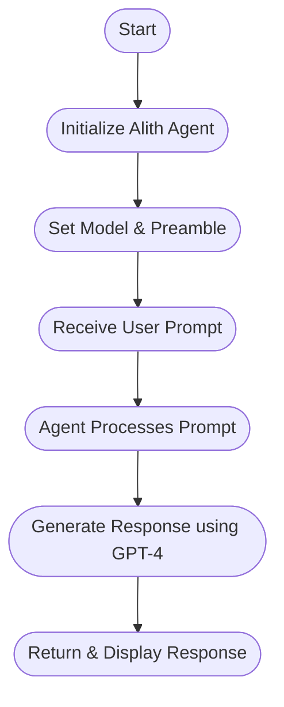
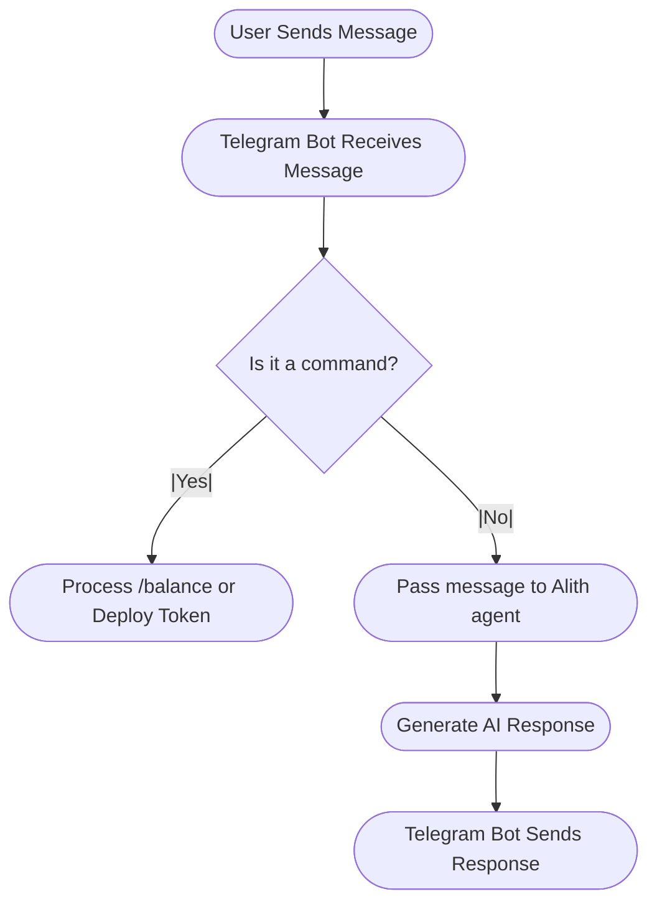

# Intro-to-Alith-AI-Framework

Introductory workshop to start working with the **Alith AI Agent Framework**. This repository is designed to help you learn how AI agents work in general, understand what makes the Alith framework unique, and explore practical code examples in Python.

---

## Table of Contents

- [Overview of AI Agents](#overview-of-ai-agents)
- [What is the Alith AI Agent Framework?](#what-is-the-alith-ai-agent-framework)
- [Why Alith is Unique](#why-alith-is-unique)
- [Installation & Quick Start](#installation--quick-start)
- [Code Walkthrough](#code-walkthrough)
  - [test_alith.py ](#test_alithpy-snippet)
  - [tg-bot.py (Snippet)](#tg-botpy-snippet)
- [Diagrams](#diagrams--visual-aids)
- [Further Documentation](#further-documentation)

---

## Overview of AI Agents

**AI agents** are autonomous programs that interact with data and perform tasks by processing natural language, making decisions, and even engaging with users in real time. They play a critical role in various applications such as chatbots, data analysis, and automation—especially in decentralized environments where trust and transparency are key.

---

## What is the Alith AI Agent Framework?

The **Alith AI Agent Framework** is a multi-language toolkit designed for building intelligent agents. It streamlines the process of integrating advanced AI models (such as GPT-4) with blockchain components, providing a seamless development experience. Whether you’re building intelligent assistants, integrating with existing tools, or experimenting with language models, Alith makes it easy with support for Rust, Python, and Node.js.

---

## Why Alith is Unique

- **Multi-Language Integration:** Write and deploy AI agents using your language of choice.  
- **Blockchain-Ready:** Easily integrate with decentralized systems and smart contracts.  
- **Optimized Performance:** Benefit from asynchronous execution and native support for advanced AI models.  
- **Ease of Use:** Comprehensive installation instructions, quick start guides, and code examples lower the barrier to entry.  
- **Extensibility:** Adaptable for various use cases—from simple chatbots to complex automation systems.

---

## Installation & Quick Start

---

### Installing Alith (Python)

To get started with the Alith framework using Python, first ensure you have Python 3.8+ installed.

Install the Alith SDK via pip:

```bash
pip install alith
```

If you’re running the example with OpenAI or another model provider, set your API key as an environment variable:

**Unix/macOS**
```bash
export OPENAI_API_KEY="your-api-key"
```

**Windows (Powershell)**
```powershell
$env:OPENAI_API_KEY = "your-api-key"
```

---

For full details and Python/Node.js usage, please refer to the [Alith Documentation](https://alith.lazai.network/docs).

---

## Code Walkthrough

### test_alith.py 

This script shows how to create a simple AI agent using GPT-4 with a comedic role. It initializes the agent, sends a prompt, and prints the response.

```python
from alith import Agent

def main():
    # Create an Agent using GPT-4 with a comedic role
    agent = Agent(
        name="Comedian Agent",
        model="gpt-4",
        preamble="You are a stand-up comedian who cracks jokes and makes people laugh."
    )

    # Prompt the agent
    user_message = "Entertain me with a short joke!"
    response = agent.prompt(user_message)

    print("AI Agent Response:", response)

if __name__ == "__main__":
    main()
```

**Key Points:**
- `Agent(...)`: Instantiates an AI agent with a specified name, model, and preamble.
- `prompt(...)`: Sends a prompt to the agent and retrieves the response.

---

### tg-bot.py (Snippet)

This script integrates the Alith framework into a Telegram bot. The bot can handle user greetings, token balance checks, and token deployments on Metis Sepolia. Below is a simplified snippet:

```python
import os
from telegram import Update, InlineKeyboardButton, InlineKeyboardMarkup
from telegram.ext import (
    Application,
    CommandHandler,
    MessageHandler,
    filters,
    CallbackContext,
    CallbackQueryHandler
)
from alith import Agent
from web3 import Web3

# Initialize Alith Agent
agent = Agent(
    name="Telegram Bot Agent",
    model="gpt-4",
    preamble="You are an advanced AI assistant built by Alith."
)

# Initialize Telegram Bot
bot_token = os.getenv("TELEGRAM_BOT_TOKEN")
app = Application.builder().token(bot_token).build()

async def handle_message(update: Update, context: CallbackContext) -> None:
    user_text = update.message.text
    response = agent.prompt(user_text)
    await context.bot.send_message(chat_id=update.effective_chat.id, text=response)

# Set up handlers
app.add_handler(MessageHandler(filters.TEXT & (~filters.COMMAND), handle_message))

if __name__ == "__main__":
    print("Starting Telegram Bot...")
    app.run_polling()
```

**Key Points:**
- Demonstrates how to create a Telegram bot using the Python `telegram` library.
- Integrates Alith’s `Agent` for AI-based responses.
- Expands into advanced features like token deployment, balance checks, and interactive menus in the full script.

---

## Diagrams & Visual Aids

### 1. Alith AI Agent Workflow



### 2. Telegram Bot Integration Flow




---

## Further Documentation

For more details, installation guides, and advanced usage examples, please refer to our [Alith Documentation](https://alith.lazai.network/docs).


